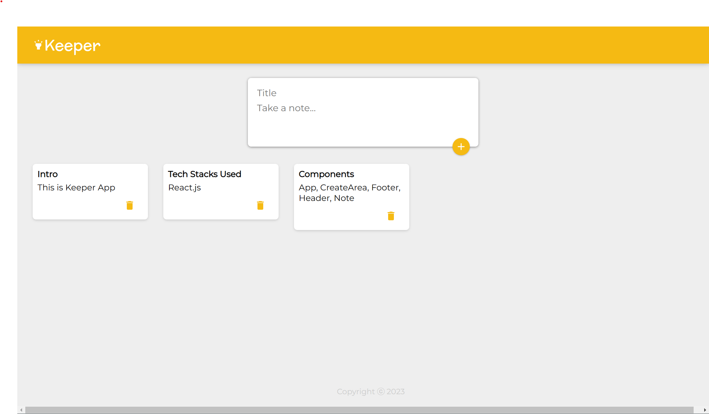

# 🔦 Keeper-App


## What does Keeper App do

- Keeper App is a Simple React App that lets you keep your notes at one place. <br />
- 'Add Notes with Title' and 'Delete' them whenever you wish. <br />


## Live Application URL

Go to Deployed Application link 👇 <br />
<a href="https://kakuli-coder.github.io/Keeper-App/" alt="App-link" target="_blank">Keeper App</a> </br>


## Keeper App Preview
 <br />


## Prerequisites

### Install Node JS
Refer <a href="https://nodejs.org/en/" alt="node.js-link" target="_blank">Official Website</a> to download and install Node.js

### Install create-react-app
Install create-react-app npm package globally. This will help to easily run the project and also build the source files easily. Use the following command to install create-react-app:

```
npm install -g create-react-app
```

## Cloning and Running the Application in local

1. Clone the project into local.

2. Install all the npm packages. Go into the project folder and type the following command to install all npm packages.

```
  npm install
  ```

3. In order to run the application, type the following command:

```
npm start
```

The Application runs on **127.0.0.1:3000**
